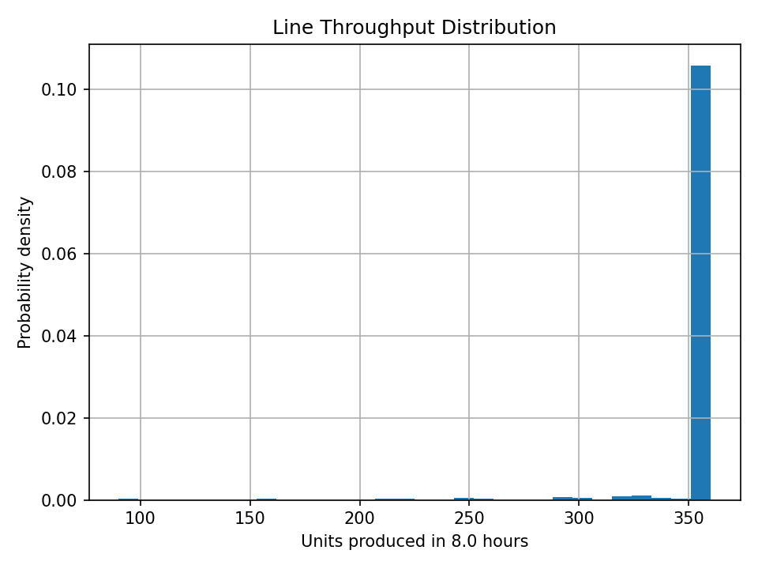
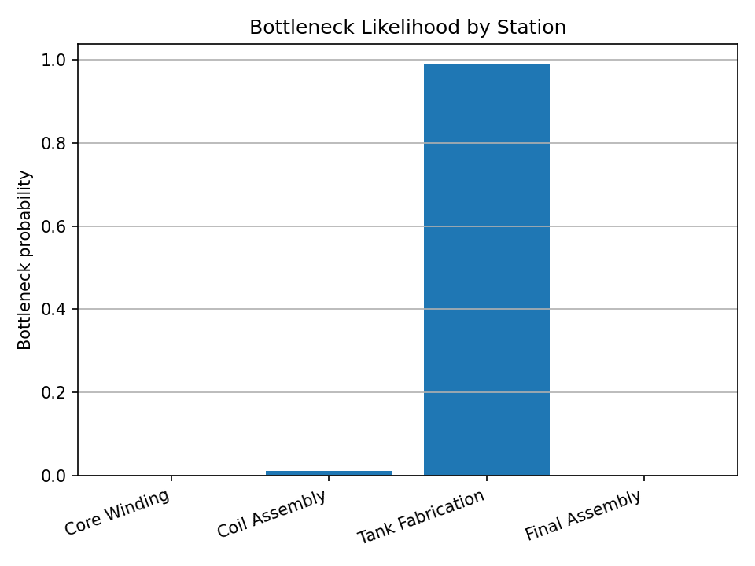
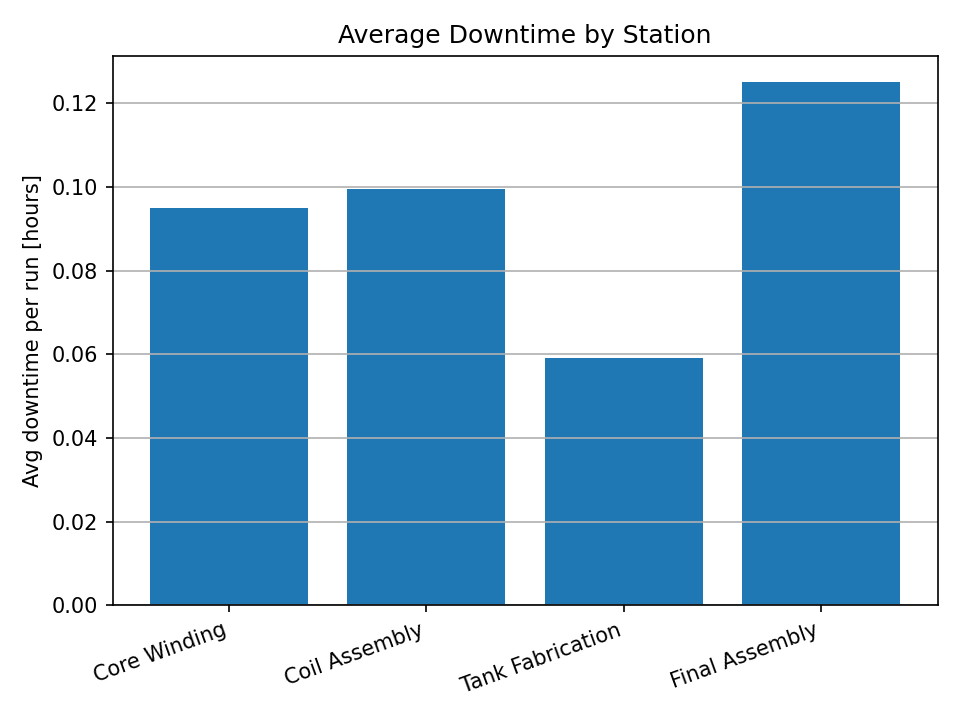

# Multi-Machine Uptime & Bottleneck Simulator

A **factory-scale production uptime and bottleneck analysis engine** built in Python using **Monte Carlo simulation** to quantify **throughput risk, downtime losses, and station-level bottleneck probability** across complex manufacturing lines.

This tool is designed for **reliability engineering, industrial systems analysis, and production optimization**.

---

## 🚀 Features

- Multi-station production line modeling (serial flow)
- Parallel machines per station
- Random failure generation using MTBF
- Random repair modeling using MTTR
- Monte Carlo throughput simulation
- Automated bottleneck probability detection
- Downtime loss quantification
- Engineering plots saved automatically:
  - Line throughput distribution
  - Bottleneck probability by station
  - Average downtime per station

---

## 🧠 Engineering Use Cases

- Production throughput risk forecasting  
- Preventive maintenance planning  
- Bottleneck identification & line balancing  
- Downtime loss analysis  
- Capacity planning & manufacturing optimization  

---

## ⚙️ How It Works

Each station in the production line is modeled using:

- **Mean cycle time**
- **Mean Time Between Failures (MTBF)**
- **Mean Time To Repair (MTTR)**
- **Number of parallel machines**

Each machine undergoes:
- Random uptime periods sampled from exponential distributions (MTBF)
- Random repair durations sampled from exponential distributions (MTTR)

For each Monte Carlo run:
- Total station output is computed
- **Line throughput is limited by the lowest-output station**
- The bottleneck station is recorded

After many runs, the simulator outputs:
- Throughput distribution
- Bottleneck probability per station
- Average downtime per station

---

## 📊 Outputs

### Line Throughput Distribution


### Bottleneck Probability by Station


### Average Downtime by Station



---

## 🛠 Running the Project

### Install requirements:
```bash
pip install numpy matplotlib
